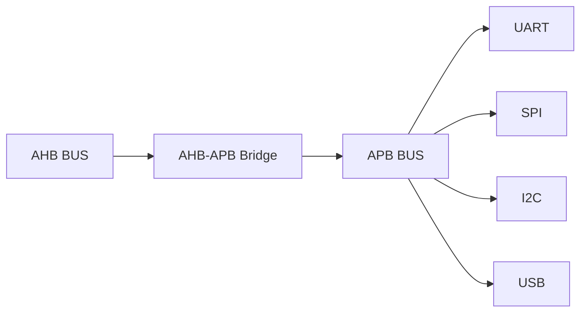
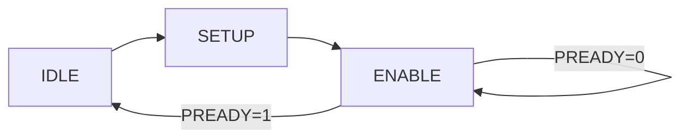
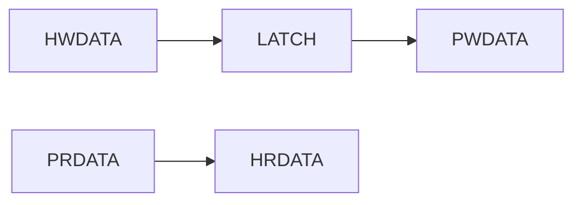
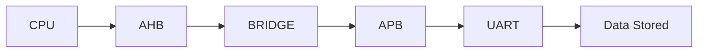

<h1 align="center"> AHB to APB Bridge - Verilog RTL Design </h1>

---

Implementation of an <b>AHB to APB Bridge</b> that converts pipelined AHB transactions into sequential APB transfers using FSM-based control.

---

# Bridge Architecture

- AHB provides high-speed pipelined transactions  
- Bridge converts protocol and timing  
- APB distributes to low-speed peripherals  
- Ensures only one APB transfer at a time  

---

# Transfer Flow

- Address and control captured from AHB  
- Signals stored in internal registers (pipeline break)  
- APB SETUP phase asserts PSEL  
- ENABLE phase asserts PENABLE and completes transfer  

---

# FSM Design

- IDLE waits for valid AHB transfer  
- SETUP drives APB control signals  
- ENABLE performs actual data transfer  
- PREADY controls completion and wait states  

---

# Data Path

- Write data flows from AHB → APB  
- Read data flows from APB → AHB  
- Internal registers isolate pipeline timing  

---

# Data Flow Example

- CPU initiates transaction  
- AHB carries high-speed request  
- Bridge converts protocol  
- APB executes peripheral access  

---

# FSM State Behavior

## IDLE
- Wait for valid transfer (HTRANS = NONSEQ/SEQ)  
- Latch address, write, size  
- Assert HREADY low to stall AHB  

## SETUP
- Drive PADDR, PWRITE, PWDATA  
- Assert PSEL  
- Prepare APB transfer  

## ENABLE
- Assert PENABLE  
- Wait for PREADY  
- Complete transfer and return response  

---

# Transfer Types

## Write Transfer

- HWRITE = 1 → PWRITE = 1  
- Data flows to peripheral  

## Read Transfer

- HWRITE = 0 → PWRITE = 0  
- Data returned to AHB  

## Wait State Transfer

- PREADY = 0  
- Bridge holds HREADY = 0  
- Stalls AHB pipeline  

## Error Transfer

- PSLVERR = 1  
- HRESP = ERROR  

---

# Key Signals

## AHB Side
- HADDR, HWRITE, HTRANS  
- HWDATA → Write data  
- HRDATA ← Read data  
- HREADY → Handshake  
- HRESP → Status  

## APB Side
- PADDR, PWRITE  
- PSEL, PENABLE  
- PWDATA / PRDATA  
- PREADY, PSLVERR  

---

# Key Design Concepts

## Pipeline Break
- AHB is pipelined  
- APB is sequential  
- Registers isolate timing  

## Handshake Conversion
- HREADY ↔ PREADY  
- HRESP ↔ PSLVERR  

## Wait Handling
- APB delay → stalls AHB  
- Maintains protocol correctness  

---

<b>
The AHB-APB Bridge ensures correct protocol translation between high-speed and low-speed domains, enabling reliable and scalable SoC integration.

  
---
